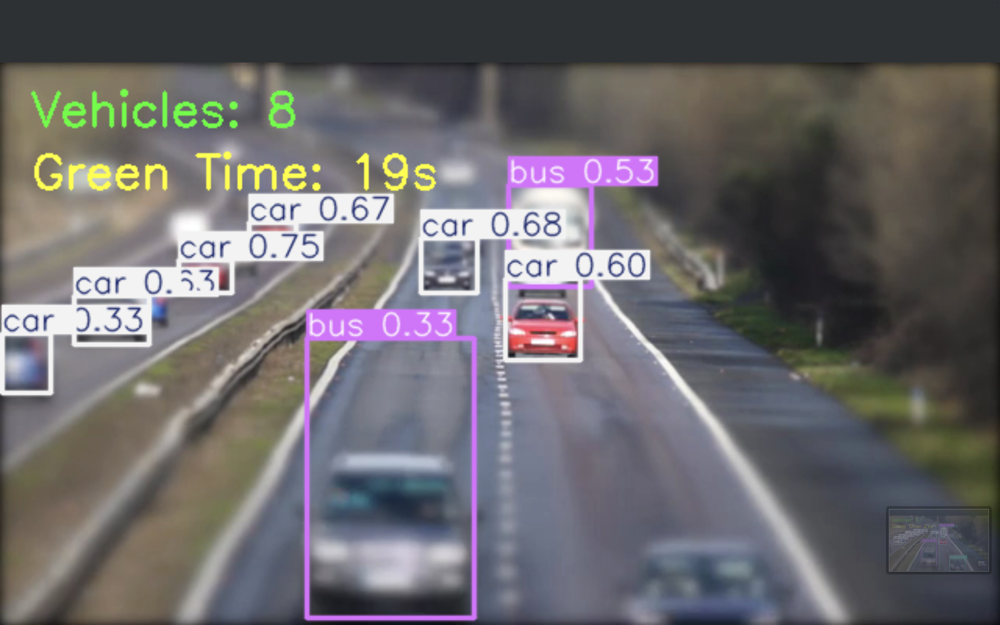
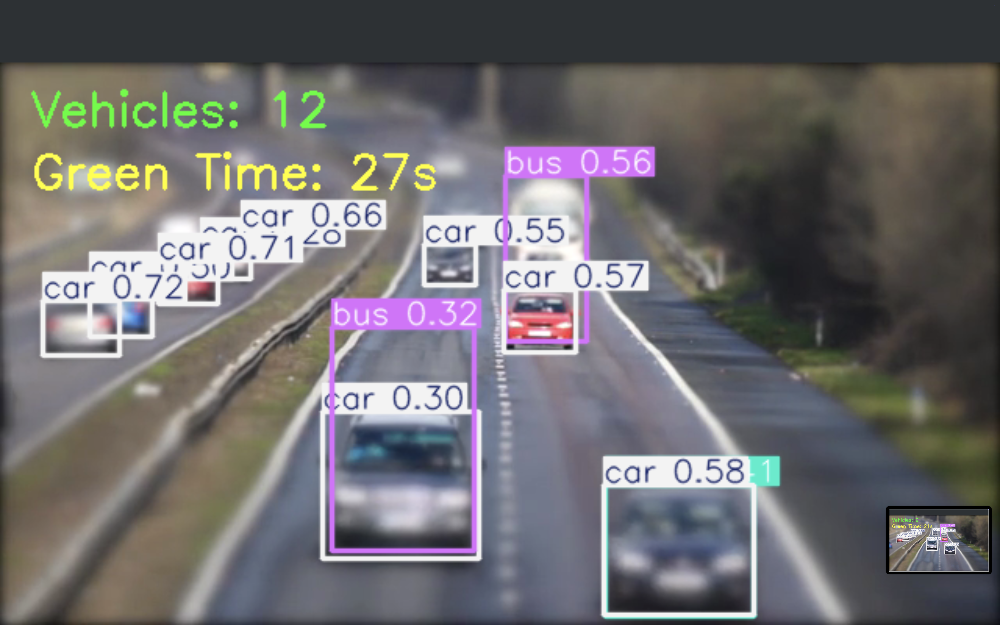

#  Smart Traffic Monitoring & Prediction System

>  Recently retrained (2026) using Kaggle GPU for improved detection accuracy

An intelligent traffic monitoring system that uses deep learning and computer vision to detect vehicles and estimate real-time traffic density for adaptive signal control.

---

##  Problem Statement

Urban traffic congestion leads to increased travel time, fuel consumption, and pollution. Traditional traffic signals operate on fixed timers and do not adapt to real-time traffic conditions.

This project aims to solve this problem by building a system that dynamically analyzes traffic density using computer vision.

---

##  Approach

The system follows a complete end-to-end pipeline:

1. Input traffic image/video
2. Vehicle detection using YOLOv5
3. Object counting
4. Traffic density classification
5. Signal timing decision

YOLOv5 was chosen due to its real-time detection capability and high accuracy in object detection tasks.

---

##  Tech Stack

* Python
* YOLOv5
* OpenCV
* NumPy, Pandas
* Kaggle (GPU-based training)
* Git & GitHub

---

##  Model Training

The model was trained on a custom annotated dataset using Kaggle notebooks.

* Image size: 640
* Epochs: 50
* Batch size: 16
* Pretrained weights: yolov5s.pt

The training process generated optimized weights (`best.pt`) based on validation performance.

---

##  Results

### Traffic Detection Outputs




The model successfully detects multiple vehicle types and provides reliable traffic density estimation.

---

##  How to Run

##  How to Run

Follow these steps to run the project locally:

###  Clone the Repository

```bash
git clone https://github.com/Harsh0980/Smart-Traffic-Monitoring-Prediction-System.git
```

---

###  Navigate to Project Directory

```bash
cd Smart-Traffic-Monitoring-Prediction-System
```

---

###  Install Dependencies

```bash
pip install -r requirements.txt
```

---

###  Run Vehicle Detection

```bash
python detect.py --weights best.pt --source sample.mp4
```

---

###  Notes

* Ensure `best.pt` is present in the project directory
* Replace `sample.mp4` with your own image/video file if needed


---

##  Model Weights

The trained model (`best.pt`) is not included due to size limitations.

📥 Download here: https://drive.google.com/file/d/1aJD7CxoI5pJX_yVgBAyr6AgE3idR5C7F/view?usp=sharing

---

##  Future Improvements

* Real-time signal control integration
* Multi-camera traffic analysis
* Web dashboard for monitoring
* Model optimization for edge devices

---

##  Key Learnings

* Practical implementation of object detection
* Understanding of training pipelines in YOLOv5
* Handling real-world data and limitations
* Building an end-to-end ML system

---

##  License

This project is licensed under the MIT License - see the LICENSE file for details.

---

##  Acknowledgments

- YOLOv5 by Ultralytics for real-time object detection  
- Kaggle for cloud-based GPU training  
- Open-source traffic datasets used for model training  
- OpenCV for image and video processing  
